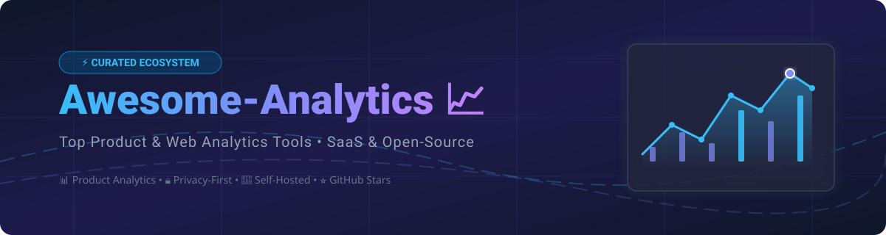

# 📈 Awesome-Analytics: Top Product & Web Analytics Ecosystem 🚀

  

  
  
  
  
  

---

## 💡 Overview & Market Insights 🔍

Welcome to **Awesome-Analytics** — a curated list of top SaaS products and open-source GitHub projects for product analytics, web traffic measurement, session replay, funnels, and event tracking.

> **📊 Market Size & Industry Structure:**  
> The global product and web analytics market size is estimated at **$15.2 Billion in 2026** and is projected to grow at a CAGR of ~17.5% through 2030. The market is **moderately fragmented**: hyper-scale tech platforms like Google Analytics dominate standard web analytics traffic, while enterprise product analytics leaders (Contentsquare, Amplitude, Mixpanel, Pendo) and privacy-first self-hosted tools (PostHog, Umami, Plausible, Matomo) compete fiercely across developer, growth, and enterprise segments.

---

## 📑 Table of Contents 📌

- [☁️ SaaS / Hosted Platforms](#-saas--hosted-platforms)
- [🔓 Open-Source GitHub Projects](#-open-source-github-projects)
- [🤝 How to Contribute](#-how-to-contribute)
- [💖 Support & Sponsorship](#-support--sponsorship)
- [⚠️ Disclaimer](#%EF%B8%8F-disclaimer)
- [📈 Star History](#-star-history)

---

## ☁️ SaaS / Hosted Platforms 💼

Below is a curated list of top commercial SaaS analytics platforms, sorted in descending order by **Company Valuation / Market Cap**:

| Platform 🛠️ | Valuation / Market Cap 💰 | Key Focus Areas 🎯 | Starting Paid Tier Pricing 💳 | Free Forever Plan / Trial Limit 🎁 |
| :--- | :--- | :--- | :--- | :--- |
| **[Google Analytics](https://analytics.google.com/)** | **~$4.21 Trillion** *(Alphabet)* | Web & App traffic, conversions, search acquisition | $50,000 / year *(GA360 Enterprise)* | Free Forever *(Standard GA4 with unlimited standard traffic reporting)* |
| **[Contentsquare](https://contentsquare.com/)** | **~$5.60 Billion** | Digital experience analytics, heatmaps, UX insights | ~$10,000 / year *(Enterprise contract)* | 14-Day Free Trial *(Full enterprise feature access)* |
| **[Pendo](https://www.pendo.io/)** | **~$2.60 Billion** | Product analytics, in-app guidance, user feedback | ~$7,000 / year *(Starter plan)* | Free Forever *(Up to 500 Monthly Active Users)* |
| **[Amplitude](https://amplitude.com/)** | **~$1.65 Billion** *(Market Cap)* | Product analytics, event tracking, funnels, behavioral cohorts | $49 / month *(Plus Tier up to 300k events)* | Free Forever *(Up to 2,000,000 monthly events)* |
| **[PostHog Cloud](https://posthog.com/)** | **~$1.40 Billion** | All-in-one product analytics, session replay, feature flags | $0.00031 / event after free tier *(Pay-as-you-go)* | Free Forever *(1,000,000 events + 5,000 recordings / mo)* |
| **[Mixpanel](https://mixpanel.com/)** | **~$1.10 Billion** | Event-based product analytics, funnels, retention tracking | $24 / month *(Growth tier)* | Free Forever *(Up to 1,000,000 monthly events)* |
| **[FullStory](https://www.fullstory.com/)** | **~$500 Million** | Session replay, DX insights, rage clicks, friction detection | $299 / month *(Business tier)* | 14-Day Free Trial *(Includes 5,000 free sessions/mo on Business plan)* |
| **[Kissmetrics](https://www.kissmetrics.io/)** | **~$100 Million** | SaaS revenue analytics, customer journey, funnel tracking | $299 / month *(Silver tier)* | 14-Day Free Trial *(Access to core funnel tracking)* |

---

## 🔓 Open-Source GitHub Projects 🚀

Discover privacy-friendly, self-hostable open-source analytics repositories. Sorted in descending order by **GitHub Stars_Count**:

| Repository 📦 | GitHub_Stars ⭐ | Description 📝 | License 📜 | Primary Stack / Features 💻 |
| :--- | :--- | :--- | :--- | :--- |
| **[PostHog](https://github.com/PostHog/posthog)** |  | All-in-one suite with product analytics, session replay, feature flags & A/B testing. | MIT | Python, TypeScript, ClickHouse |
| **[Umami](https://github.com/umami-software/umami)** |  | Fast, lightweight, privacy-focused alternative to Google Analytics. | MIT | Node.js, Next.js, PostgreSQL/MySQL |
| **[Plausible](https://github.com/plausible/analytics)** |  | Simple, lightweight & privacy-friendly web analytics without cookies. | AGPL-3.0 | Elixir, ClickHouse, PostgreSQL |
| **[Matomo](https://github.com/matomo-org/matomo)** |  | Mature, full-featured web analytics platform protecting user privacy. | GPL-3.0 | PHP, MySQL |
| **[OpenPanel](https://github.com/openpanel-dev/openpanel)** |  | Next-gen open-source product analytics combining web and app tracking. | AGPL-3.0 | Next.js, ClickHouse |
| **[Snowplow](https://github.com/snowplow/snowplow)** |  | Enterprise-grade behavioral data collection platform and event pipeline. | Apache-2.0 | Scala, Java, Cloud Native |
| **[GoatCounter](https://github.com/arp242/goatcounter)** |  | Minimalist web statistics designed as a lightweight privacy alternative. | EUPL-1.2 | Go, SQLite/PostgreSQL |
| **[Countly](https://github.com/Countly/countly-server)** |  | Real-time product analytics for mobile, web, and desktop applications. | AGPL-3.0 | Node.js, MongoDB |
| **[Shlink](https://github.com/shlinkio/shlink)** |  | Self-hosted URL shortener with detailed visit tracking & analytics. | MIT | PHP, Swoole, Expressive |
| **[Ackee](https://github.com/electerious/Ackee)** |  | Self-hosted, Node.js-based analytics for privacy-focused web developers. | MIT | Node.js, MongoDB, GraphQL |
| **[RudderStack](https://github.com/rudderlabs/rudder-server)** |  | Open-source Customer Data Platform (CDP) for event streaming & pipelines. | AGPL-3.0 | Go, PostgreSQL |

---

## 🤝 How to Contribute 🛠️

Contributions are welcome! Follow these simple steps to add or update analytics tools:

1. 🍴 **Fork** this repository.
2. ✏️ **Edit** `README.md` to add your submission following the existing table formatting.
3. 📝 **Ensure** accurate, factual details regarding pricing, free limits, and open-source licenses.
4. 🚀 **Submit a Pull Request** with a clear explanation of your additions!

---

## 💖 Support & Sponsorship 🙏

Thank you for visiting **Awesome-Analytics**! If you find this curated list helpful for choosing analytics tools or discovering open-source alternatives, please consider supporting the project:

- ⭐ **Star** this repository to help others discover it.
- 🔄 **Fork & Share** it with your fellow growth engineers, PMs, and developers.
- ☕ **Buy a Coffee / Sponsor**: Support ongoing maintenance via [GitHub Sponsors](https://github.com/sponsors/ishandutta2007).

---

## ⚠️ Disclaimer 📜

- This repository is a **community-curated list** provided for informational and educational purposes.
- Valuation figures and pricing structures reflect publicly reported market data as of **September 2026** and are subject to change.
- Analytics systems involve personal data processing. Always ensure compliance with GDPR, CCPA, and applicable local data privacy laws.

---

## 📈 Star History

---

  <b>⭐ Star this repo to support open analytics! ⭐</b>

